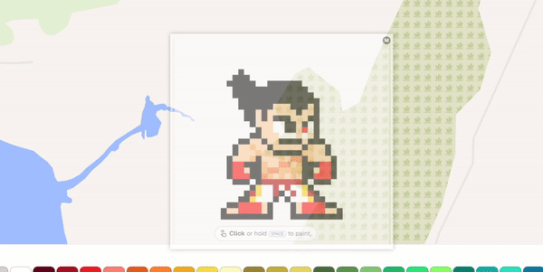
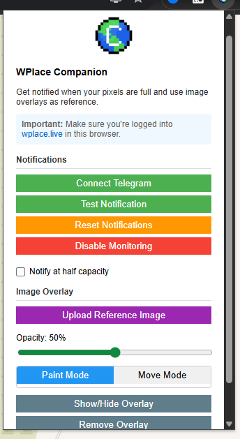

  
  

# Wplace Companion (Chrome Extension)

Wplace Companion is a helper extension for [wplace.live](https://wplace.live).  
It has two main features:

1. **Pixel Notifications**  
   - The extension checks your WPlace pixel count by calling the backend API every 2–5 minutes.  
   - When your pixels are full (or at half capacity, if enabled), it can send you a Telegram message so you don’t miss out on painting.  

2. **Image Overlay Reference**  
   - Upload or paste an image to display it directly on top of the WPlace canvas.  
   - Move, resize, scale, and rotate the overlay to align it with the canvas.  
   - Adjust opacity for better visibility.  
   - Switch between **Paint Mode** (clicks go to WPlace) and **Move Mode** (drag the overlay).  
   - Hide or remove the overlay at any time.

---

## Installation 

1. Download or clone this repository.
2. Open Chrome and go to `chrome://extensions/`.
3. Enable **Developer mode**.
4. Click **Load unpacked** and select this folder.

---

## Important Notice

- This extension calls the WPlace backend API every **2–5 minutes** to check your pixel count.  
- Using automation may violate Wplace Terms of Service. Use at your own risk.  

---

## License

MIT

